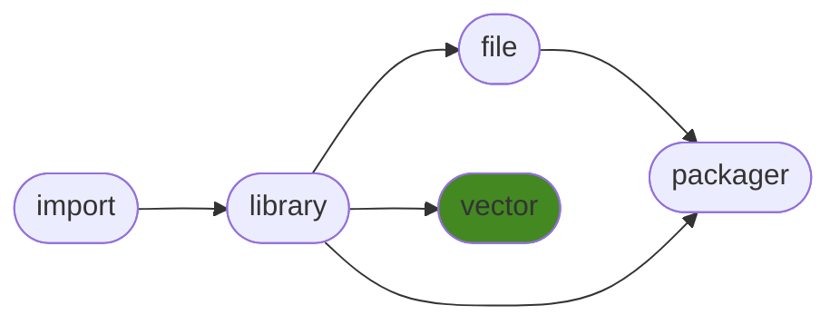

# generalvector
Simple immutable vectors.

## Contents
<pre>
<a href='#generalvector'>generalvector</a>
├─ <a href='#Dependency-Diagram'>Dependency Diagram</a>
├─ <a href='#Installation-showing-dependencies'>Installation showing dependencies</a>
├─ <a href='#Information'>Information</a>
├─ <a href='#Attributes'>Attributes</a>
├─ <a href='#Contributions'>Contributions</a>
└─ <a href='#Todo'>Todo</a>
</pre>

## Dependency Diagram

## Installation showing dependencies
| `pip install`                                                        | `generalvector`   |
|:---------------------------------------------------------------------|:------------------|
| <a href='https://pypi.org/project/generallibrary'>generallibrary</a> | ✔️                |

## Information
| Package                                                          | Ver                                                | Latest Release        | Python                                                                                                                                                                                  | Platform        | Cover   |
|:-----------------------------------------------------------------|:---------------------------------------------------|:----------------------|:----------------------------------------------------------------------------------------------------------------------------------------------------------------------------------------|:----------------|:--------|
| [generalvector](https://github.com/ManderaGeneral/generalvector) | [1.5.110](https://pypi.org/project/generalvector/) | 2022-10-07 16:07 CEST | [3.8](https://www.python.org/downloads/release/python-380/), [3.9](https://www.python.org/downloads/release/python-390/), [3.10](https://www.python.org/downloads/release/python-3100/) | Windows, Ubuntu | 52.4 %  |

## Attributes
<pre>
<a href='https://github.com/ManderaGeneral/generalvector/blob/9d94e2e/generalvector/__init__.py#L1'>Module: generalvector</a>
├─ <a href='https://github.com/ManderaGeneral/generalvector/blob/9d94e2e/generalvector/vector.py#L10'>Class: Vec</a>
│  ├─ <a href='https://github.com/ManderaGeneral/generalvector/blob/9d94e2e/generalvector/vector.py#L122'>Method: clamp</a>
│  ├─ <a href='https://github.com/ManderaGeneral/generalvector/blob/9d94e2e/generalvector/vector.py#L168'>Method: distance</a>
│  ├─ <a href='https://github.com/ManderaGeneral/generalvector/blob/9d94e2e/generalvector/vector.py#L142'>Method: hex</a>
│  ├─ <a href='https://github.com/ManderaGeneral/generalvector/blob/9d94e2e/generalvector/vector.py#L133'>Method: inrange</a>
│  ├─ <a href='https://github.com/ManderaGeneral/generalvector/blob/9d94e2e/generalvector/vector.py#L67'>Method: length</a>
│  ├─ <a href='https://github.com/ManderaGeneral/generalvector/blob/9d94e2e/generalvector/vector.py#L113'>Method: max</a>
│  ├─ <a href='https://github.com/ManderaGeneral/generalvector/blob/9d94e2e/generalvector/vector.py#L104'>Method: min</a>
│  ├─ <a href='https://github.com/ManderaGeneral/generalvector/blob/9d94e2e/generalvector/vector.py#L73'>Method: normalized</a>
│  ├─ <a href='https://github.com/ManderaGeneral/generalvector/blob/9d94e2e/generalvector/vector.py#L88'>Method: random</a>
│  ├─ <a href='https://github.com/ManderaGeneral/generalvector/blob/9d94e2e/generalvector/vector.py#L149'>Method: range</a>
│  └─ <a href='https://github.com/ManderaGeneral/generalvector/blob/9d94e2e/generalvector/vector.py#L82'>Method: round</a>
└─ <a href='https://github.com/ManderaGeneral/generalvector/blob/9d94e2e/generalvector/vector2.py#L9'>Class: Vec2</a>
   ├─ <a href='https://github.com/ManderaGeneral/generalvector/blob/9d94e2e/generalvector/vector2.py#L122'>Method: clamp</a>
   ├─ <a href='https://github.com/ManderaGeneral/generalvector/blob/9d94e2e/generalvector/vector2.py#L161'>Method: distance</a>
   ├─ <a href='https://github.com/ManderaGeneral/generalvector/blob/9d94e2e/generalvector/vector2.py#L132'>Method: inrange</a>
   ├─ <a href='https://github.com/ManderaGeneral/generalvector/blob/9d94e2e/generalvector/vector2.py#L67'>Method: length</a>
   ├─ <a href='https://github.com/ManderaGeneral/generalvector/blob/9d94e2e/generalvector/vector2.py#L113'>Method: max</a>
   ├─ <a href='https://github.com/ManderaGeneral/generalvector/blob/9d94e2e/generalvector/vector2.py#L104'>Method: min</a>
   ├─ <a href='https://github.com/ManderaGeneral/generalvector/blob/9d94e2e/generalvector/vector2.py#L73'>Method: normalized</a>
   ├─ <a href='https://github.com/ManderaGeneral/generalvector/blob/9d94e2e/generalvector/vector2.py#L88'>Method: random</a>
   ├─ <a href='https://github.com/ManderaGeneral/generalvector/blob/9d94e2e/generalvector/vector2.py#L143'>Method: range</a>
   └─ <a href='https://github.com/ManderaGeneral/generalvector/blob/9d94e2e/generalvector/vector2.py#L82'>Method: round</a>
</pre>

## Contributions
Issue-creation and discussions are most welcome!

Pull requests are not wanted, please discuss with me before investing any time

## Todo
| Module                                                                                                           | Message                                                                                                                                    |
|:-----------------------------------------------------------------------------------------------------------------|:-------------------------------------------------------------------------------------------------------------------------------------------|
| <a href='https://github.com/ManderaGeneral/generalvector/blob/master/generalvector/general.py#L1'>general.py</a> | <a href='https://github.com/ManderaGeneral/generalvector/blob/master/generalvector/general.py#L7'>Move most methods to _GeneralVector.</a> |

Generated 2022-10-07 16:07 CEST for commit <a href='https://github.com/ManderaGeneral/generalvector/commit/9d94e2e'>9d94e2e</a>.

